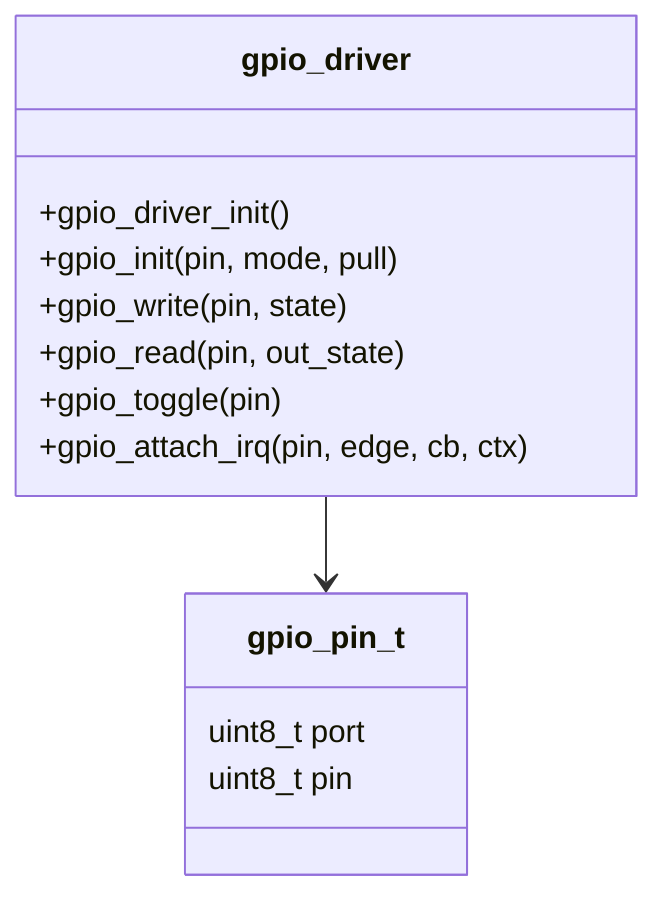

# :material-led-on: GPIO Driver

!!! abstract "What You'll Learn"
    - Understand the HAL-style GPIO driver API
    - Use gpio_pin_t struct for portable pin references
    - Attach interrupt callbacks via the driver

---

## :material-lightbulb-on: Intuition

A well-designed GPIO driver abstracts the MCU's register layout behind a clean API. The same application code works across STM32, AVR, and RP2040 by swapping the driver implementation.

---

## :material-vector-polyline: Diagram



---

## :material-code-tags: Code Examples

=== "Driver API (gpio.h)"
    ```c
    typedef enum { GPIO_MODE_INPUT, GPIO_MODE_OUTPUT, GPIO_MODE_ALT, GPIO_MODE_ANALOG } gpio_mode_t;
    typedef enum { GPIO_PULL_NONE, GPIO_PULL_UP, GPIO_PULL_DOWN } gpio_pull_t;
    typedef enum { GPIO_IRQ_RISING, GPIO_IRQ_FALLING, GPIO_IRQ_BOTH } gpio_irq_edge_t;
    typedef struct { uint8_t port; uint8_t pin; } gpio_pin_t;
    typedef void (*gpio_irq_cb_t)(void *ctx);

    drv_status_t gpio_init(const gpio_pin_t *pin, gpio_mode_t mode, gpio_pull_t pull);
    drv_status_t gpio_write(const gpio_pin_t *pin, bool state);
    drv_status_t gpio_read(const gpio_pin_t *pin, bool *out_state);
    drv_status_t gpio_toggle(const gpio_pin_t *pin);
    drv_status_t gpio_attach_irq(const gpio_pin_t *pin, gpio_irq_edge_t edge,
                                  gpio_irq_cb_t cb, void *ctx);
    ```

=== "Usage Example"
    ```c
    static const gpio_pin_t LED  = {.port = 2, .pin = 13};  // PC13
    static const gpio_pin_t BTN  = {.port = 0, .pin = 0};   // PA0

    void button_pressed(void *ctx) {
        gpio_toggle(&LED);
    }

    int main(void) {
        gpio_driver_init();
        gpio_init(&LED, GPIO_MODE_OUTPUT, GPIO_PULL_NONE);
        gpio_init(&BTN, GPIO_MODE_INPUT, GPIO_PULL_UP);
        gpio_attach_irq(&BTN, GPIO_IRQ_FALLING, button_pressed, NULL);

        while (1) { /* LED toggled by ISR */ }
    }
    ```

---

## :material-alert: Pitfalls

!!! warning "Common Mistakes"
    - Always validate pin parameters in the driver (null check, port/pin range check) — return DRV_ERR_INVALID instead of hard-faulting
    - The callback is called from ISR context — keep it minimal

---

## :material-help-circle: Flashcards

???+ question "What is drv_status_t used for?"
    A return code enum (DRV_OK, DRV_ERR_BUSY, DRV_ERR_INVALID, DRV_ERR_TIMEOUT) that lets callers handle errors without exceptions.

???+ question "How does gpio_attach_irq differ from directly writing EXTI registers?"
    The driver abstracts EXTI/port selection, NVIC setup, and callback registration. Application code expresses intent (edge, callback) not mechanism (AFIO, EXTICR bits).

---

## :material-check-circle: Summary

GPIO driver: portable API with gpio_pin_t struct. Driver handles register-level details; app uses init/write/read/toggle/attach_irq. Return drv_status_t for all operations.
