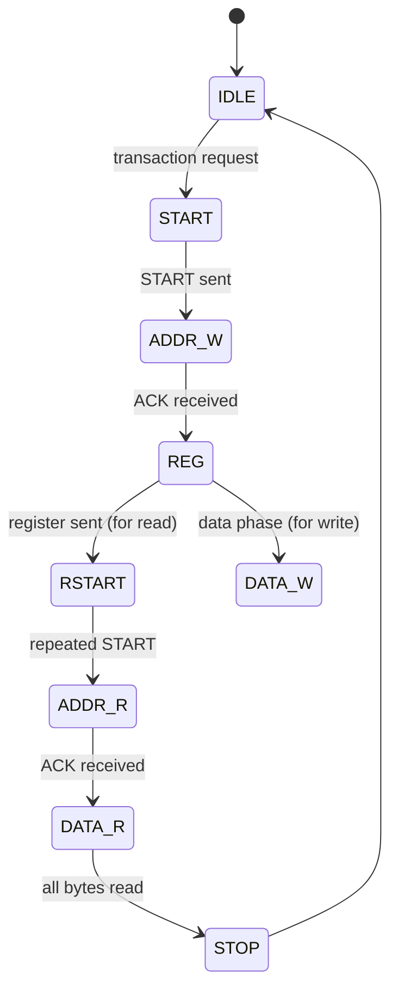

# :material-transit-connection: I2C Driver

!!! abstract "What You'll Learn"
    - Implement I2C master write and read transactions
    - Handle timeout and bus error recovery
    - Support common sensor register access pattern

---

## :material-lightbulb-on: Intuition

I2C driver exposes `i2c_write_reg` and `i2c_read_reg` that hide the START/address/ACK/STOP state machine from the application.

---

## :material-vector-polyline: Diagram



---

## :material-code-tags: Code Examples

=== "I2C Read Register API"
    ```c
    drv_status_t i2c_read_reg(uint8_t dev_addr, uint8_t reg,
                               uint8_t *data, uint8_t len) {
        // Write register address
        if (!i2c_start(dev_addr, false)) return DRV_ERR_TIMEOUT;
        if (!i2c_write_byte(reg))        return DRV_ERR_NACK;

        // Read data
        if (!i2c_start(dev_addr, true))  return DRV_ERR_TIMEOUT;
        for (uint8_t i = 0; i < len; i++) {
            bool ack = (i < len - 1);    // NACK last byte
            if (!i2c_read_byte(&data[i], ack)) return DRV_ERR_TIMEOUT;
        }
        i2c_stop();
        return DRV_OK;
    }
    ```

---

## :material-alert: Pitfalls

!!! warning "Common Mistakes"
    - Add timeout to every polling loop (waiting for SR1 flags). Without timeout, a disconnected device causes infinite loop
    - After bus error, send 9 SCL clocks and STOP to reset the bus

---

## :material-help-circle: Flashcards

???+ question "How to detect I2C address of an unknown device?"
    Scan: for addr in 0x08..0x77: send START + addr, if ACK received the device exists at that address.

???+ question "What causes 'bus busy' even after reset?"
    Slave held SDA low during a transaction that was interrupted. Recovery: generate 9 SCL pulses then a STOP condition.

---

## :material-check-circle: Summary

I2C driver: abstract START/ADDR/ACK/STOP behind read_reg/write_reg API. Add timeout to all polling waits. Handle bus errors with recovery sequence.
