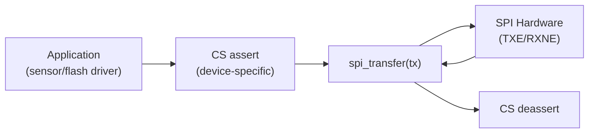

# :material-transfer: SPI Driver

!!! abstract "What You'll Learn"
    - Implement SPI master with configurable mode and baud rate
    - Support DMA-based transfers for large buffers
    - Manage multiple devices on the same SPI bus

---

## :material-lightbulb-on: Intuition

SPI driver exposes `spi_transfer` (full-duplex) and `spi_read/write` wrappers. CS management is typically left to the device driver layer above.

---

## :material-vector-polyline: Diagram



---

## :material-code-tags: Code Examples

=== "Polling Transfer"
    ```c
    uint8_t spi_transfer_byte(SPI_TypeDef *spi, uint8_t tx) {
        while (!(spi->SR & SPI_SR_TXE));   // wait TX empty
        spi->DR = tx;
        while (!(spi->SR & SPI_SR_RXNE));  // wait RX not empty
        return spi->DR;
    }

    void spi_transfer_buf(SPI_TypeDef *spi,
                           const uint8_t *tx, uint8_t *rx, uint16_t len) {
        for (uint16_t i = 0; i < len; i++) {
            rx[i] = spi_transfer_byte(spi, tx ? tx[i] : 0xFF);
        }
    }
    ```

---

## :material-alert: Pitfalls

!!! warning "Common Mistakes"
    - Always wait for BSY flag to clear before deasserting CS (some MCUs latch the last byte after TXE goes high but before transmit completes)
    - Different devices on the same bus may need different CPOL/CPHA — reconfigure SPI or use dedicated SPI buses

---

## :material-help-circle: Flashcards

???+ question "SPI DMA benefit?"
    CPU is free during large transfers. For a 256-byte flash read at 10MHz SPI, polling takes ~200µs of CPU time. DMA takes ~0µs (CPU continues other work).

???+ question "How to share one SPI bus between two devices with different modes?"
    Disable SPI (CR1 SPE=0), change CPOL/CPHA, re-enable. Or use hardware NSS with proper CS timing.

---

## :material-check-circle: Summary

SPI driver: wait TXE, write DR, wait RXNE, read DR. Wait BSY before CS deassert. DMA for large transfers. CS management in device-layer above driver.
