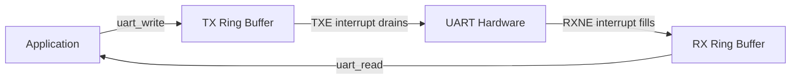

# :material-serial-port: UART Driver

!!! abstract "What You'll Learn"
    - Design a non-blocking UART driver with interrupt RX
    - Expose simple read/write byte API
    - Use ring buffers for TX and RX queues

---

## :material-lightbulb-on: Intuition

A production UART driver never blocks. It queues bytes for TX (interrupt-driven drain) and stores received bytes in a ring buffer for the application to consume at its own pace.

---

## :material-vector-polyline: Diagram



---

## :material-code-tags: Code Examples

=== "Ring Buffer Implementation"
    ```c
    typedef struct {
        uint8_t  buf[UART_BUF_SIZE];
        uint32_t head;
        uint32_t tail;
    } ring_buf_t;

    static bool rb_push(ring_buf_t *rb, uint8_t byte) {
        uint32_t next = (rb->head + 1) % UART_BUF_SIZE;
        if (next == rb->tail) return false;  // full
        rb->buf[rb->head] = byte;
        rb->head = next;
        return true;
    }

    static bool rb_pop(ring_buf_t *rb, uint8_t *out) {
        if (rb->head == rb->tail) return false;  // empty
        *out = rb->buf[rb->tail];
        rb->tail = (rb->tail + 1) % UART_BUF_SIZE;
        return true;
    }
    ```

---

## :material-alert: Pitfalls

!!! warning "Common Mistakes"
    - Buffer size must be a power of 2 if you optimize with `& (SIZE-1)` instead of `% SIZE`
    - RX buffer overrun (buffer full, ISR drops byte) is silent — consider an overflow counter for diagnostics

---

## :material-help-circle: Flashcards

???+ question "Why have both TX and RX ring buffers?"
    TX: application submits bytes, ISR drains them when UART is ready (non-blocking write). RX: ISR deposits bytes immediately, application reads at its own pace.

???+ question "How to implement uart_write_string efficiently?"
    Copy string to TX ring buffer, then enable TXE interrupt. ISR pops one byte per TXE event, disables TXE interrupt when buffer empties.

---

## :material-check-circle: Summary

UART driver: TX ring buffer (ISR drains on TXE), RX ring buffer (ISR fills on RXNE). App reads/writes non-blocking. Never block in ISR.
