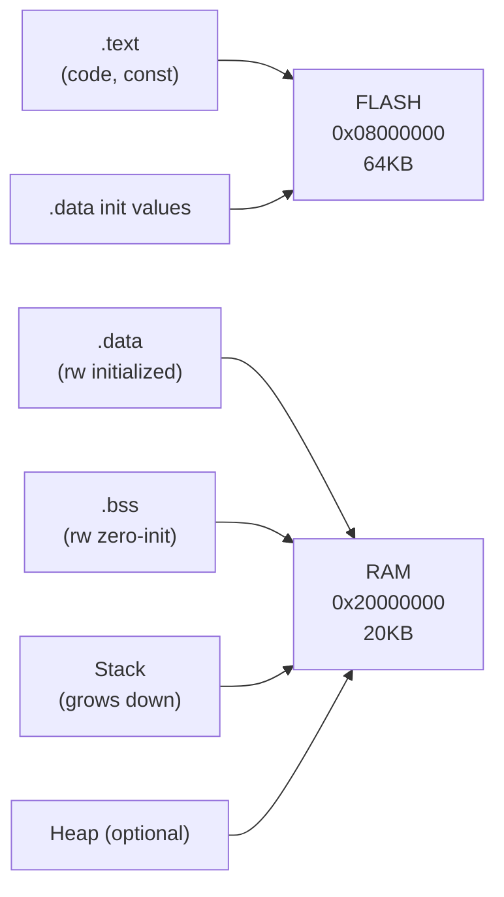

# :material-script-text: Linker Scripts

!!! abstract "What You'll Learn"
    - Read and write a minimal ARM linker script
    - Define FLASH and RAM memory regions
    - Place sections (.text, .data, .bss) correctly

---

## :material-lightbulb-on: Intuition

The linker script is the **map** of your firmware's memory. It tells the linker where to place code and data, and provides symbols the startup code uses to copy/zero sections.

---

## :material-vector-polyline: Diagram



---

## :material-code-tags: Code Examples

=== "Minimal Linker Script"
    ```
    /* STM32F103C8 - 64K Flash, 20K RAM */
    MEMORY {
        FLASH (rx)  : ORIGIN = 0x08000000, LENGTH = 64K
        RAM   (rwx) : ORIGIN = 0x20000000, LENGTH = 20K
    }

    ENTRY(Reset_Handler)

    SECTIONS {
        .text : {
            *(.isr_vector)   /* Vector table first */
            *(.text*)         /* Code */
            *(.rodata*)       /* Read-only data */
        } > FLASH

        /* .data load address in FLASH, runtime address in RAM */
        _sidata = LOADADDR(.data);
        .data : {
            _sdata = .;
            *(.data*)
            _edata = .;
        } > RAM AT > FLASH

        .bss : {
            _sbss = .;
            *(.bss*)
            *(COMMON)
            _ebss = .;
        } > RAM

        /* Stack at top of RAM */
        _estack = ORIGIN(RAM) + LENGTH(RAM);
    }
    ```

---

## :material-alert: Pitfalls

!!! warning "Common Mistakes"
    - Vector table section must come first — it must be at the start of flash
    - `AT > FLASH` places .data's **load address** in flash while its **runtime address** is in RAM

---

## :material-help-circle: Flashcards

???+ question "What is the difference between LMA and VMA?"
    **LMA** (Load Memory Address) = where the data lives in flash. **VMA** (Virtual Memory Address) = where the CPU accesses it at runtime. For `.data`, LMA is in flash, VMA is in RAM.

???+ question "Why is the vector table placed first?"
    ARM Cortex-M boots from address 0 (or remapped flash start). Entry [0] must be the initial stack pointer, [1] must be the reset handler address.

???+ question "How do you add a heap?"
    After .bss, add: `_heap_start = .; . += HEAP_SIZE; _heap_end = .;` and implement `sbrk()` using these symbols.

---

## :material-check-circle: Summary

Linker script: MEMORY (regions) + SECTIONS (placement). .text/.rodata in FLASH. .data: LMA=FLASH, VMA=RAM. .bss zeroed in RAM. _estack = top of RAM.
