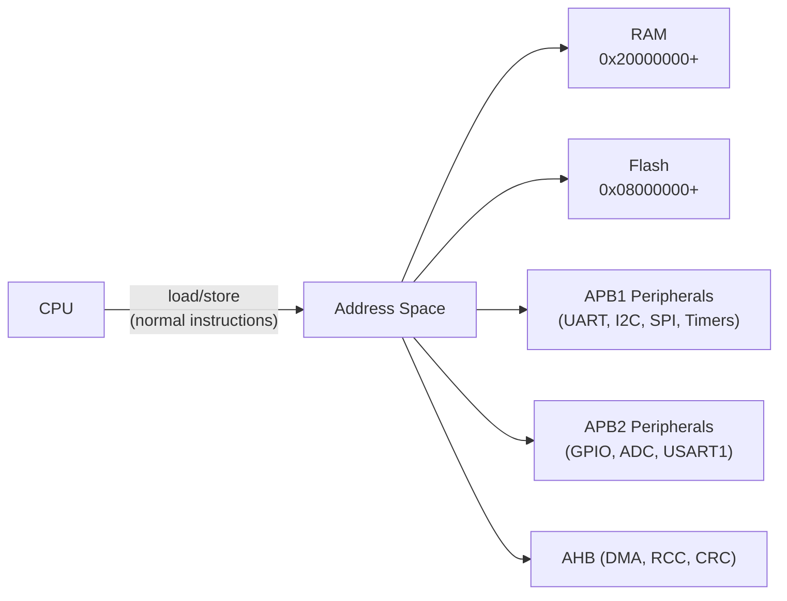

# :material-chip: Memory-Mapped IO

!!! abstract "What You'll Learn"
    - Understand how peripheral registers are mapped to memory addresses
    - Write correct register access code with `volatile`
    - Identify and avoid common MMIO bugs

---

## :material-lightbulb-on: Intuition

The CPU has one address space. Peripherals live in it — there's no separate I/O bus on ARM Cortex-M. Reading/writing an address can toggle a pin, configure a timer, or read ADC data.

!!! abstract "Memory Anchor"
    MMIO = **treat hardware like memory**. But hardware has side effects — reads can clear flags, writes trigger actions. `volatile` tells the compiler not to optimize these away.

---

## :material-vector-polyline: Diagram



---

## :material-code-tags: Code Examples

=== "Basic Register Access"
    ```c
    // Define register as volatile pointer
    #define GPIOA_BASE  0x40010800u
    #define GPIOA_CRL   (*(volatile uint32_t *)(GPIOA_BASE + 0x00u))
    #define GPIOA_ODR   (*(volatile uint32_t *)(GPIOA_BASE + 0x0Cu))

    // Set pin PA5 output
    GPIOA_CRL = (GPIOA_CRL & ~(0xF << 20)) | (0x3 << 20);

    // Toggle PA5
    GPIOA_ODR ^= (1u << 5);
    ```

=== "Read-Modify-Write (Safe)"
    ```c
    // Safe: preserves other bits
    REG |=  (1u << BIT);   // set bit
    REG &= ~(1u << BIT);   // clear bit
    REG ^=  (1u << BIT);   // toggle bit

    // Read a bit
    if (REG & (1u << BIT)) { /* bit is set */ }
    ```

=== "Access Type Semantics"
    ```c
    // W1C — write 1 to clear (status flags)
    USART_SR &= ~USART_SR_RXNE;  // WRONG — writing 0 has no effect
    USART_SR = ~USART_SR_RXNE;   // WRONG — may clear multiple flags
    // Correct: for W1C flags, just read the register (flag auto-clears on read)
    // Or check vendor docs for correct clear method

    // RO — read only
    // Reading USART_DR clears RXNE flag automatically
    uint8_t data = USART_DR;  // this clears the RXNE flag
    ```

---

## :material-alert: Pitfalls

!!! warning "Common Mistakes"
    - Missing `volatile` allows compiler to cache register reads in a CPU register — changes to hardware state become invisible
    - Never use `int*` for peripheral registers — always `volatile uint32_t*`

---

## :material-help-circle: Flashcards

???+ question "Why is `volatile` required for peripheral registers?"
    Without `volatile`, the compiler may optimize repeated reads into one, or skip writes it thinks are redundant. Peripheral registers have hardware side effects that make every access meaningful.

???+ question "What is the difference between reading UART data register and a RAM variable?"
    Reading UART DR clears the RXNE (receive not empty) flag — it has a hardware side effect. RAM reads are pure.

???+ question "What does 'reserved bits must be kept at reset value' mean?"
    These bits have undocumented internal functions. Modifying them can corrupt the peripheral's state machine. Always read-modify-write.

---

## :material-check-circle: Summary

MMIO: peripherals = memory addresses. volatile prevents optimization. Bit ops: |= set, &=~ clear, ^= toggle. Always read-modify-write to preserve other bits.
