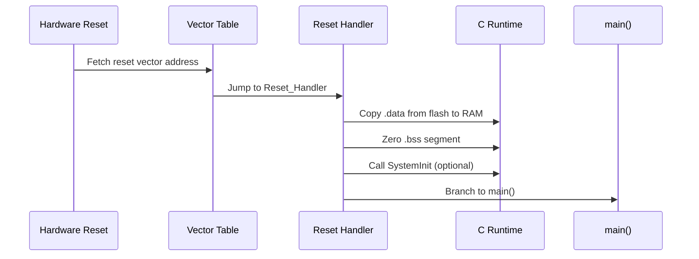

# :material-restart: Startup Code

!!! abstract "What You'll Learn"
    - Explain what happens between reset and main()
    - Implement a minimal reset handler in C
    - Understand .data, .bss, and linker symbols

---

## :material-lightbulb-on: Intuition

When the MCU resets, the CPU doesn't magically start at `main()`. It starts at the **reset vector** — a function that must prepare memory before your code can run.

!!! abstract "Memory Anchor: CDP → main"
    **C**opy .data from flash → **D**elete (zero) .bss → **P**reamble (SystemInit) → main

---

## :material-vector-polyline: Diagram



---

## :material-code-tags: Code Examples

=== "Minimal Reset Handler (C)"
    ```c
    // Linker-provided symbols
    extern uint32_t _sidata;  // .data source in flash
    extern uint32_t _sdata, _edata;  // .data destination in RAM
    extern uint32_t _sbss,  _ebss;   // .bss range in RAM

    void Reset_Handler(void) {
        // Copy .data from flash to RAM
        uint32_t *src = &_sidata;
        uint32_t *dst = &_sdata;
        while (dst < &_edata) *dst++ = *src++;

        // Zero .bss
        dst = &_sbss;
        while (dst < &_ebss) *dst++ = 0u;

        // (Optional) early clock init
        SystemInit();

        // Run application
        main();

        // Should never return
        while (1) {}
    }
    ```

=== "Vector Table"
    ```c
    // Minimum vector table (ARM Cortex-M)
    extern uint32_t _estack;  // initial stack pointer from linker

    __attribute__((section(".isr_vector")))
    void (*const vectors[])(void) = {
        (void (*)(void))&_estack,  // [0] Initial Stack Pointer
        Reset_Handler,              // [1] Reset
        NMI_Handler,               // [2] NMI
        HardFault_Handler,         // [3] Hard Fault
        // ... more handlers
    };
    ```

---

## :material-alert: Pitfalls

!!! warning "Common Mistakes"
    - If .data copy is wrong, global variables have garbage values at startup
    - If .bss is not zeroed, uninitialised globals have random values (C standard requires zero-init)

---

## :material-help-circle: Flashcards

???+ question "Where is .data at reset?"
    In flash (non-volatile). The startup code copies it to RAM where the CPU can write it.

???+ question "What is .bss?"
    The uninitialized data section. C standard guarantees global/static variables with no explicit initializer are zero. Startup code zeroes this region.

???+ question "How does the CPU find Reset_Handler?"
    The vector table is at address 0x00000000 (or 0x08000000 for STM32 flash boot). Entry [1] is the reset vector address. CPU fetches it on reset.

---

## :material-check-circle: Summary

Startup: copy .data from flash to RAM, zero .bss, call SystemInit, call main. Vector table at address 0 provides the reset handler address.
