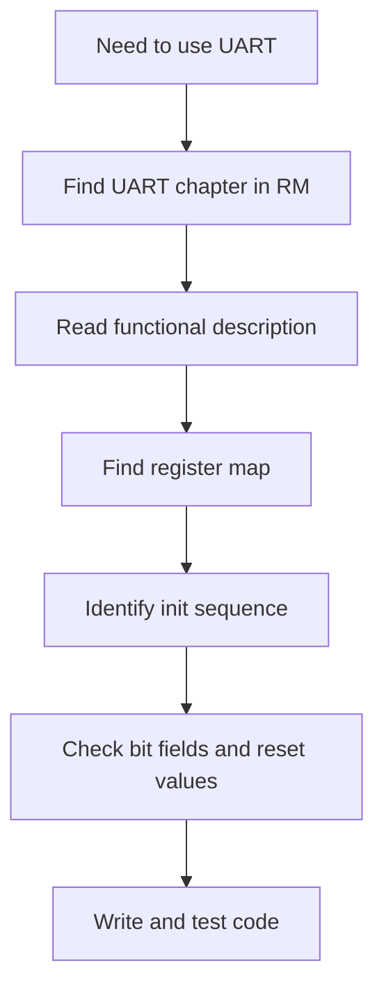

# :material-book-open-page-variant: Datasheet Reading

!!! abstract "What You'll Learn"
    - Navigate a MCU reference manual efficiently
    - Decode register bit fields
    - Identify the initialization sequence for any peripheral

---

## :material-lightbulb-on: Intuition

!!! info "The Most Important Skill"
    Every embedded bug ultimately traces back to a register. Learning to read datasheets converts mysteries into 10-minute fixes.

---

## :material-vector-polyline: Diagram



---

## :material-code-tags: Code Examples

=== "Register Map Pattern"
    ```
    Offset: 0x00  USART_SR  — Status Register
      Bit 7: TXE   Transmit data register empty (RO)
      Bit 6: TC    Transmission complete (RC_W0)
      Bit 5: RXNE  Read data register not empty (RO)

    Offset: 0x04  USART_DR  — Data Register
      Bits [8:0]: DR  Data value

    Offset: 0x08  USART_BRR — Baud Rate Register
      Bits [15:4]: DIV_Mantissa
      Bits  [3:0]: DIV_Fraction
    ```

=== "Init Sequence Pattern"
    ```c
    // Typical peripheral init sequence (any MCU)
    // 1. Enable clock
    RCC->APB2ENR |= RCC_APB2ENR_USART1EN;

    // 2. Configure pins (alternate function)
    GPIOA->CRH = (GPIOA->CRH & ~0xFF) | 0x4Bu; // TX=AF, RX=input

    // 3. Configure peripheral registers
    USART1->BRR = 72000000 / 115200;
    USART1->CR1 = USART_CR1_TE | USART_CR1_RE;

    // 4. Enable
    USART1->CR1 |= USART_CR1_UE;
    ```

---

## :material-alert: Pitfalls

!!! warning "Common Mistakes"
    - Always check reset values before assuming registers are 0
    - `W1C` (write-1-to-clear) bits: writing 0 has no effect, writing 1 clears the flag

---

## :material-help-circle: Flashcards

???+ question "What does 'Reserved bits must be kept at reset value' mean?"
    Some bits are undocumented but used internally. Writing wrong values corrupts the peripheral's state machine. Always read-modify-write.

???+ question "Where do you find the peripheral clock enable bit?"
    In the RCC (Reset and Clock Control) chapter. Each peripheral has an enable bit in APBxENR or AHBxENR.

---

## :material-check-circle: Summary

Datasheet reading: functional description → register map → init sequence → bit fields. Always check: clock enable, pin mux, register reset values, access type (RO/RW/W1C).
