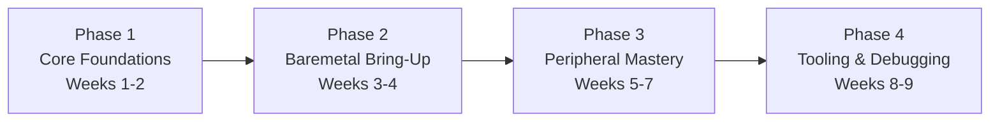

# :material-map-marker-path: Learning Path

!!! abstract "What You'll Learn"
    - Understand the 4-phase embedded learning roadmap
    - Know what to practice at each phase
    - Identify your current level

---

## :material-lightbulb-on: Intuition

!!! success "Start Here"
    Embedded development rewards **depth over breadth**. Master one peripheral at a time, bring up real hardware at each step.

This path moves from fundamental C and hardware concepts through driver architecture. Each phase has a concrete milestone that proves you've internalized the concepts.

---

## :material-vector-polyline: Diagram

---

## :material-code-tags: Code Examples

=== "Phase 1 — Core Foundations"
    **Focus:**
    - C pointers, bitwise ops, structs for embedded
    - Number systems: hex/binary, endianness, memory layout
    - Digital electronics basics: voltage, pull-up/down, debounce

    **Milestone:** Explain how a GPIO register write toggles an LED.

=== "Phase 2 — Baremetal Bring-Up"
    **Focus:**
    - Startup code and vector tables
    - Clock initialization and reset flow
    - Memory-mapped I/O and register access patterns

    **Practice:** LED blink and UART banner from cold reset (no HAL).

=== "Phase 3 — Peripheral Mastery"
    **Focus:**
    - Timers, PWM, UART, SPI, I2C, ADC, Interrupts
    - Polling vs interrupt-driven design
    - Error handling and timeout patterns

    **Milestone:** Read sensor over I2C and print via UART.

=== "Phase 4 — Tooling & Debugging"
    **Focus:**
    - GDB + OpenOCD for source-level debugging
    - Logic analyser for bus protocol verification
    - JTAG/SWD flashing and boundary scan
    - Linker scripts and memory map inspection

    **Milestone:** Debug a firmware bug without printf.

---

## :material-alert: Pitfalls

!!! warning "Common Mistakes"
    - Don't skip Phase 1 — missing bit manipulation knowledge causes subtle bugs later
    - Don't use vendor HAL until you understand the registers it wraps

---

## :material-help-circle: Flashcards

???+ question "What is the first peripheral to bring up on a new MCU?"
    **GPIO output** — blink an LED. It verifies: clock enabled, pin configured, write works, your toolchain produces correct binaries.

???+ question "Why avoid printf for early debugging?"
    UART requires clock setup, pin mux, and baud configuration. If any of those fail, printf silently drops output. Use GPIO toggle or SWD breakpoints first.

???+ question "What is the key skill gap between beginner and competent embedded developers?"
    Understanding the hardware state machine — knowing which registers to configure, in what order, and what side effects each write has.

---

## :material-check-circle: Summary

4 phases: Foundations → Bring-Up → Peripherals → Tooling. Each phase has a concrete hardware milestone. Master GPIO before UART; UART before SPI/I2C.
