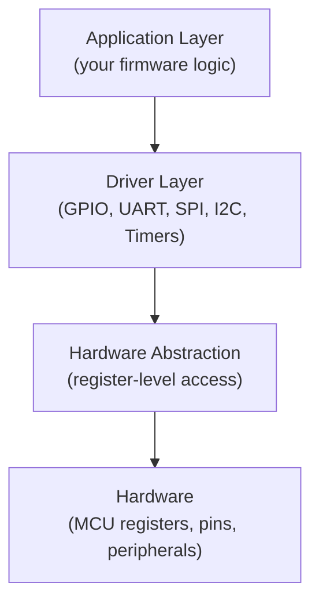

# :material-chip: Learn Embedded Basics

> **Baremetal firmware from first principles — registers, peripherals, drivers, and MCU bring-up.**

-   :material-rocket-launch: **Getting Started**

    ---

    Learning path · Toolchain setup · Datasheet reading

    [:octicons-arrow-right-24: Begin here](getting-started/index.md)

-   :material-memory: **Fundamentals**

    ---

    Memory-mapped IO · Startup code · Linker scripts · Debugging

    [:octicons-arrow-right-24: Core concepts](fundamentals/index.md)

-   :material-connection: **Peripherals**

    ---

    GPIO · UART · SPI · I2C · Timers · PWM · ADC · Interrupts

    [:octicons-arrow-right-24: Peripheral guide](peripherals/index.md)

-   :material-wrench: **Drivers**

    ---

    HAL-style driver architecture for GPIO, UART, I2C, SPI

    [:octicons-arrow-right-24: Driver patterns](drivers/index.md)

-   :material-cpu-64-bit: **MCU Profiles**

    ---

    STM32F103 · AVR ATmega328P · RP2040 · MSP430 · nRF52832

    [:octicons-arrow-right-24: MCU reference](mcu-profiles/index.md)

---

## :material-map: Embedded Dev Stack

---

## :material-school: Learning Phases

| Phase | Focus | Milestone |
|-------|-------|-----------|
| 1 | C for embedded, number systems, memory | GPIO register write toggles LED |
| 2 | Startup code, clocks, MMIO | UART banner from cold reset |
| 3 | Timers, PWM, UART, SPI, I2C, ADC | Multi-peripheral app with stable timing |
| 4 | Tooling: GDB, OpenOCD, logic analyser | Debug firmware without printf |
