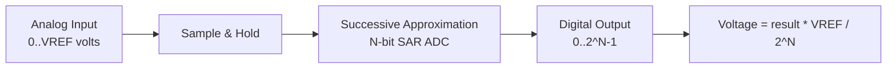

# :material-waveform: ADC — Analog to Digital Conversion

!!! abstract "What You'll Learn"
    - Configure ADC for single conversion mode
    - Read ADC result and convert to voltage
    - Understand resolution, reference voltage, and sampling time

---

## :material-lightbulb-on: Intuition

ADC converts an analog voltage (0 to VREF) into a digital number (0 to 2^N - 1). The MCU can then process sensor data from temperature sensors, potentiometers, etc.

---

## :material-vector-polyline: Diagram



---

## :material-code-tags: Code Examples

=== "STM32 Single Conversion"
    ```c
    uint16_t adc_read(uint8_t channel) {
        // Select channel, sampling time
        ADC1->SQR3 = channel;
        ADC1->SMPR2 = (7u << (3*channel));  // 239.5 cycles sampling

        // Start conversion
        ADC1->CR2 |= ADC_CR2_SWSTART;
        while (!(ADC1->SR & ADC_SR_EOC));   // wait end of conversion

        return ADC1->DR;  // 12-bit result (0-4095)
    }

    float adc_to_voltage(uint16_t raw) {
        return (raw * 3.3f) / 4096.0f;  // for 3.3V VREF, 12-bit ADC
    }
    ```

---

## :material-alert: Pitfalls

!!! warning "Common Mistakes"
    - ADC clock must be ≤ 14MHz (STM32F1). Set prescaler accordingly
    - Longer sampling time improves accuracy for high-impedance sources

---

## :material-help-circle: Flashcards

???+ question "12-bit ADC reading of 2048 with 3.3V reference = ?"
    2048 * 3.3 / 4096 = **1.65V** (exactly half of reference).

???+ question "What is oversampling and why use it?"
    Taking multiple ADC readings and averaging. Each doubling of samples adds 0.5 bits of effective resolution. Useful when you need > 12 bits without external ADC.

---

## :material-check-circle: Summary

ADC: N-bit result = analog_voltage * 2^N / VREF. 12-bit STM32: 0-4095 maps to 0-3.3V. Longer sampling = better accuracy for high-impedance.
