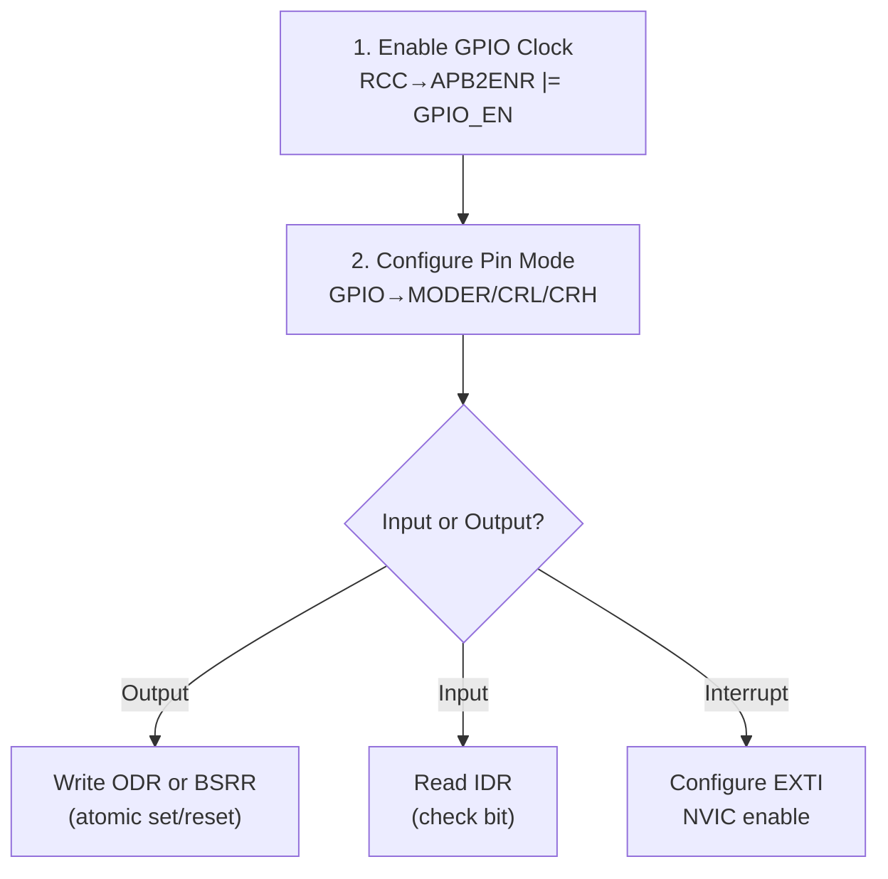

# :material-led-on: GPIO — General Purpose Input/Output

!!! abstract "What You'll Learn"
    - Configure GPIO pin as input/output/alternate function
    - Enable peripheral clock before accessing GPIO registers
    - Use pull-up/pull-down resistors correctly
    - Implement GPIO interrupts via EXTI

---

## :material-lightbulb-on: Intuition

GPIO is the **first peripheral to master**. Every embedded bring-up starts here: blink an LED to verify your toolchain, clock config, and pin access all work.

!!! abstract "3-step GPIO recipe"
    1. **Enable clock** for the GPIO port (e.g., RCC→APB2ENR)
    2. **Configure mode** (input/output/AF/analog) + speed/pull
    3. **Access data** via IDR (input) or ODR/BSRR (output)

---

## :material-vector-polyline: Diagram



---

## :material-code-tags: Code Examples

=== "STM32F1 — Output (LED)"
    ```c
    // Enable GPIOC clock
    RCC->APB2ENR |= (1u << 4);   // bit 4 = IOPCEN

    // PC13: output, max 2MHz, push-pull (CRH bits [23:20])
    GPIOC->CRH = (GPIOC->CRH & ~(0xFu << 20)) | (0x2u << 20);

    // Toggle PC13
    GPIOC->ODR ^= (1u << 13);

    // Atomic set/reset via BSRR (no read-modify-write race)
    GPIOC->BSRR = (1u << 13);          // set PC13
    GPIOC->BSRR = (1u << (13 + 16));   // reset PC13
    ```

=== "STM32F4+ — Modern API"
    ```c
    // Using MODER register (2 bits per pin)
    GPIOA->MODER &= ~(3u << (5*2));  // clear PA5 mode
    GPIOA->MODER |=  (1u << (5*2));  // output mode

    // OTYPER: 0=push-pull, 1=open-drain
    GPIOA->OTYPER &= ~(1u << 5);     // push-pull

    // PUPDR: 00=none, 01=pull-up, 10=pull-down
    GPIOA->PUPDR &= ~(3u << (5*2));  // no pull

    // Output via ODR
    GPIOA->ODR |= (1u << 5);
    ```

=== "EXTI Interrupt"
    ```c
    // PA0 rising edge interrupt (STM32)
    RCC->APB2ENR |= RCC_APB2ENR_IOPAEN | RCC_APB2ENR_AFIOEN;
    GPIOA->CRL   &= ~(0xFu << 0);       // PA0 input floating
    AFIO->EXTICR[0] = 0;                 // EXTI0 → PA
    EXTI->IMR    |= EXTI_IMR_IM0;        // unmask line 0
    EXTI->RTSR   |= EXTI_RTSR_TR0;       // rising trigger
    NVIC_EnableIRQ(EXTI0_IRQn);
    NVIC_SetPriority(EXTI0_IRQn, 1);

    void EXTI0_IRQHandler(void) {
        if (EXTI->PR & EXTI_PR_PR0) {
            // handle button press
            EXTI->PR = EXTI_PR_PR0;      // clear pending (W1C)
        }
    }
    ```

---

## :material-alert: Pitfalls

!!! warning "Common Mistakes"
    - Peripheral clock must be enabled **before** accessing any peripheral register — reading/writing without clock causes hard fault
    - Use BSRR (not ODR) for atomic set/reset to avoid race conditions in interrupt-driven code

---

## :material-help-circle: Flashcards

???+ question "Why use BSRR instead of ODR for output?"
    BSRR is a write-only atomic set/reset register. Writing bit N sets pin N; writing bit N+16 resets it. No read-modify-write needed — eliminates race conditions in ISRs.

???+ question "How to configure a pin as open-drain?"
    Set OTYPER bit for that pin (STM32F4+) or configure CNF bits to 01 (open-drain output) in CRL/CRH (STM32F1). Open-drain is required for I2C lines and wired-OR logic.

???+ question "What is a floating input and why is it bad?"
    A floating (unconnected) input has no defined voltage level. It picks up noise and toggles randomly. Always configure unused inputs with pull-up or pull-down.

---

## :material-check-circle: Summary

GPIO: enable clock → configure mode → read/write. Use BSRR for atomic output. EXTI for interrupts: configure trigger, unmask, enable NVIC, clear pending in ISR.
