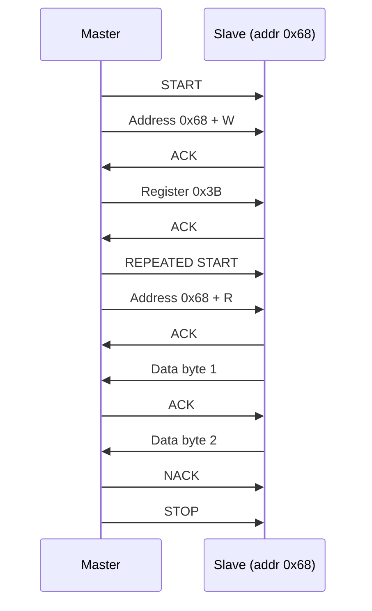

# :material-transit-connection: I2C — Two-Wire Bus

!!! abstract "What You'll Learn"
    - Configure I2C at standard (100kHz) or fast (400kHz) speed
    - Perform read and write transactions with 7-bit addressing
    - Handle ACK/NACK and bus errors

---

## :material-lightbulb-on: Intuition

I2C uses just 2 wires (SDA + SCL) and supports multiple devices on the same bus — each identified by a 7-bit address. It's slower than SPI but simpler wiring for sensors and EEPROMs.

!!! abstract "I2C frame structure"
    START → 7-bit address + R/W bit → ACK → data bytes → ACK → STOP

---

## :material-vector-polyline: Diagram



---

## :material-code-tags: Code Examples

=== "Read Register via I2C"
    ```c
    // Write register address then read data (common pattern)
    bool i2c_read_reg(uint8_t dev_addr, uint8_t reg, uint8_t *data, uint8_t len) {
        // Write phase: send register address
        I2C1->CR1 |= I2C_CR1_START;
        while (!(I2C1->SR1 & I2C_SR1_SB));  // wait START sent
        I2C1->DR = (dev_addr << 1) | 0;     // address + write
        while (!(I2C1->SR1 & I2C_SR1_ADDR));
        (void)I2C1->SR2;                     // clear ADDR
        I2C1->DR = reg;
        while (!(I2C1->SR1 & I2C_SR1_BTF));

        // Read phase
        I2C1->CR1 |= I2C_CR1_START;         // repeated START
        while (!(I2C1->SR1 & I2C_SR1_SB));
        I2C1->DR = (dev_addr << 1) | 1;     // address + read
        I2C1->CR1 |= I2C_CR1_ACK;
        while (!(I2C1->SR1 & I2C_SR1_ADDR));
        (void)I2C1->SR2;
        for (uint8_t i = 0; i < len; i++) {
            if (i == len-1) I2C1->CR1 &= ~I2C_CR1_ACK;  // NACK last
            while (!(I2C1->SR1 & I2C_SR1_RXNE));
            data[i] = I2C1->DR;
        }
        I2C1->CR1 |= I2C_CR1_STOP;
        return true;
    }
    ```

---

## :material-alert: Pitfalls

!!! warning "Common Mistakes"
    - I2C lines must be open-drain with pull-up resistors (typically 4.7kΩ for 100kHz, 2.2kΩ for 400kHz)
    - Bus lockup: if SDA stays low, master must generate 9 clock pulses to free it

---

## :material-help-circle: Flashcards

???+ question "How to find a device's I2C address?"
    Bus scan: iterate 0x08 to 0x77, send address byte, check for ACK. Most sensors have fixed addresses in datasheet; some have configurable LSB bits.

???+ question "What causes I2C bus lockup?"
    Master reset during a transaction can leave slave clock-stretched. The slave holds SDA low waiting for more clocks. Recovery: send 9 SCLK pulses then STOP.

---

## :material-check-circle: Summary

I2C: 2 wires, open-drain, 7-bit addresses. Pattern: START → addr+W → ACK → data → STOP. Read: write reg addr, repeated START, addr+R, read bytes, NACK last, STOP.
