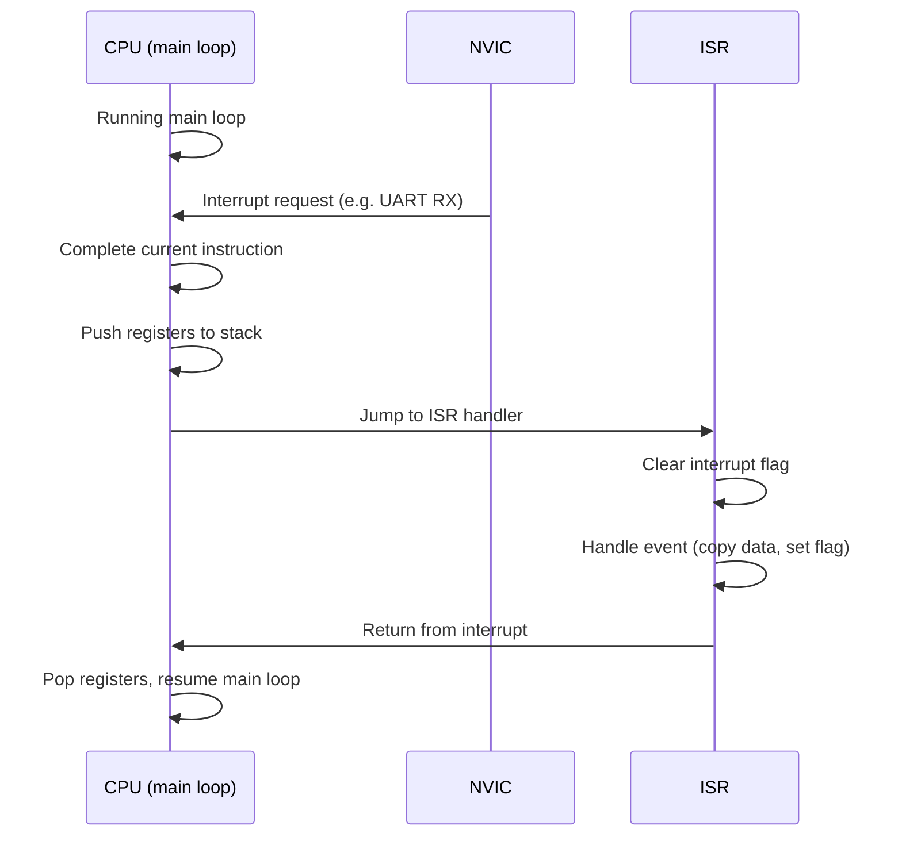

# :material-bell: Interrupts

!!! abstract "What You'll Learn"
    - Understand NVIC priority levels and preemption
    - Write a correct ISR (clear flags, minimal work)
    - Avoid common interrupt bugs: reentrance, race conditions

---

## :material-lightbulb-on: Intuition

Interrupts make embedded systems **responsive**. Without them, you'd poll every peripheral constantly. With them, the CPU does real work and reacts to events only when they occur.

!!! abstract "ISR Golden Rules"
    1. Keep ISRs **short** — set a flag, copy data, return
    2. Clear the interrupt flag **at the start** of the ISR
    3. Never block or use delay functions inside an ISR

---

## :material-vector-polyline: Diagram



---

## :material-code-tags: Code Examples

=== "Correct ISR Pattern"
    ```c
    volatile bool rx_ready = false;
    volatile uint8_t rx_data;

    void USART1_IRQHandler(void) {
        if (USART1->SR & USART_SR_RXNE) {
            rx_data = USART1->DR;  // reading DR clears RXNE
            rx_ready = true;
            // DO NOT: call printf, sleep, or other blocking code
        }
    }

    // Main loop processes data
    int main(void) {
        while (1) {
            if (rx_ready) {
                rx_ready = false;
                process_byte(rx_data);  // handle outside ISR
            }
        }
    }
    ```

=== "NVIC Priority"
    ```c
    // Lower number = higher priority
    NVIC_SetPriority(USART1_IRQn, 1);   // high priority
    NVIC_SetPriority(TIM2_IRQn, 3);     // lower priority
    NVIC_EnableIRQ(USART1_IRQn);

    // USART1 can preempt TIM2's ISR
    // Global disable/enable (critical section)
    __disable_irq();
    // ... atomic operation ...
    __enable_irq();
    ```

---

## :material-alert: Pitfalls

!!! warning "Common Mistakes"
    - Never read hardware registers via `volatile` variable without disabling interrupts if the ISR also modifies it (race condition)
    - Not clearing the interrupt flag causes the ISR to fire again immediately — infinite interrupt loop

---

## :material-help-circle: Flashcards

???+ question "What is interrupt latency?"
    Time from interrupt assertion to first ISR instruction. For Cortex-M it's typically 12-20 clock cycles (register stacking overhead).

???+ question "What is priority inversion?"
    A high-priority task waiting for a shared resource held by a low-priority task, while a medium-priority task runs. Solution: priority inheritance mutex.

???+ question "volatile vs mutex for ISR shared data?"
    `volatile` ensures the compiler reads/writes the variable every time. A mutex prevents race conditions between interrupts and main code. Use both for multi-byte data.

---

## :material-check-circle: Summary

ISR rules: clear flag first, minimal work, no blocking. Share data via volatile flags. Critical sections: disable_irq/enable_irq. NVIC: lower number = higher priority.
