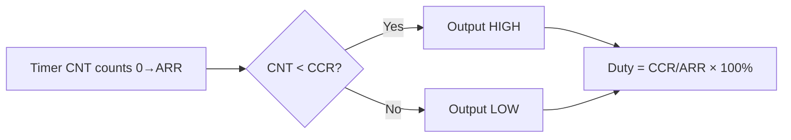

# :material-sine-wave: PWM — Pulse Width Modulation

!!! abstract "What You'll Learn"
    - Generate PWM signal using timer compare channel
    - Control duty cycle via CCR register
    - Use PWM for motor speed control and LED brightness

---

## :material-lightbulb-on: Intuition

PWM simulates analog output from a digital pin: rapidly switch between high and low at a fixed frequency; vary the duty cycle to control average power.

---

## :material-vector-polyline: Diagram



---

## :material-code-tags: Code Examples

=== "PWM Setup (STM32)"
    ```c
    void pwm_init(void) {
        RCC->APB1ENR |= RCC_APB1ENR_TIM3EN;
        RCC->APB2ENR |= RCC_APB2ENR_IOPAEN;

        // PA6 = TIM3_CH1 alternate function
        GPIOA->CRL = (GPIOA->CRL & ~(0xFu<<24)) | (0xBu<<24);

        TIM3->PSC = 72 - 1;     // 1MHz timer clock
        TIM3->ARR = 1000 - 1;   // 1kHz PWM frequency
        TIM3->CCR1 = 500;        // 50% duty cycle

        // PWM mode 1: output high while CNT < CCR1
        TIM3->CCMR1 = (6u << 4) | TIM_CCMR1_OC1PE;
        TIM3->CCER  |= TIM_CCER_CC1E;
        TIM3->CR1   |= TIM_CR1_ARPE | TIM_CR1_CEN;
    }

    // Change duty cycle (0-1000 = 0-100%)
    void pwm_set_duty(uint16_t duty) {
        TIM3->CCR1 = duty;
    }
    ```

---

## :material-alert: Pitfalls

!!! warning "Common Mistakes"
    - PWM frequency = timer frequency / (ARR+1). Duty cycle = CCR / (ARR+1) × 100%
    - Higher ARR gives finer duty cycle resolution but lower PWM frequency

---

## :material-help-circle: Flashcards

???+ question "What PWM frequency is suitable for motor control?"
    Typically 10kHz–50kHz. Below audible range (>20kHz) eliminates motor whine. Higher frequency needs faster gate drivers.

???+ question "What is center-aligned PWM vs edge-aligned?"
    Edge-aligned: counter counts 0→ARR then resets. Center-aligned: counter counts 0→ARR→0. Center-aligned reduces EMI by spreading switching events.

---

## :material-check-circle: Summary

PWM: timer compare mode. Duty = CCR/(ARR+1). Set ARR for period, CCR for duty. Higher ARR = finer resolution but lower frequency.
