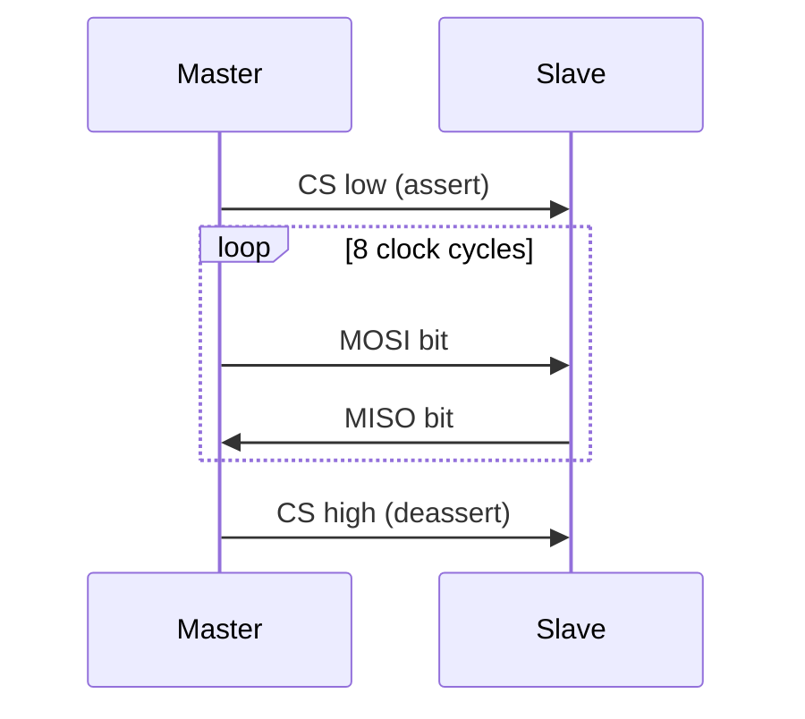

# :material-transfer: SPI — Synchronous Serial (Full-Duplex)

!!! abstract "What You'll Learn"
    - Configure SPI as master (CPOL, CPHA, baud rate)
    - Perform full-duplex byte transfer
    - Manage chip select (CS) manually for multi-device buses

---

## :material-lightbulb-on: Intuition

SPI uses a shared clock and is **full-duplex**: master and slave exchange bytes simultaneously. CS (chip select) is active-low and controlled manually.

!!! abstract "SPI in one sentence"
    Shared clock (SCLK) + MOSI (master out) + MISO (master in) + CS per device. 4-wire, full-duplex.

---

## :material-vector-polyline: Diagram



---

## :material-code-tags: Code Examples

=== "STM32 SPI Init + Transfer"
    ```c
    void spi_init(void) {
        // Enable clocks
        RCC->APB2ENR |= RCC_APB2ENR_SPI1EN | RCC_APB2ENR_IOPAEN;

        // PA5=SCK, PA6=MISO, PA7=MOSI as AF; PA4=CS as output
        GPIOA->CRL = (GPIOA->CRL & ~0xFFFF0000u) | 0xB4B30000u;

        SPI1->CR1 = SPI_CR1_MSTR      // master
                  | SPI_CR1_SSM       // software slave management
                  | SPI_CR1_SSI       // internal SS high
                  | (2u << 3)         // PCLK/8 baud
                  | SPI_CR1_SPE;      // enable
    }

    uint8_t spi_transfer(uint8_t tx) {
        while (!(SPI1->SR & SPI_SR_TXE));  // wait TX empty
        SPI1->DR = tx;
        while (!(SPI1->SR & SPI_SR_RXNE)); // wait RX not empty
        return SPI1->DR;
    }
    ```

=== "CS Control Pattern"
    ```c
    #define CS_LOW()   GPIOA->BSRR = (1u << (4+16))  // reset PA4
    #define CS_HIGH()  GPIOA->BSRR = (1u << 4)        // set PA4

    void spi_read_register(uint8_t reg, uint8_t *data, uint16_t len) {
        CS_LOW();
        spi_transfer(reg | 0x80u);  // read command (device-specific)
        for (uint16_t i = 0; i < len; i++) data[i] = spi_transfer(0xFF);
        CS_HIGH();
    }
    ```

---

## :material-alert: Pitfalls

!!! warning "Common Mistakes"
    - CPOL/CPHA must match the slave device's datasheet (4 modes: 0,0 / 0,1 / 1,0 / 1,1)
    - Always deassert CS between transactions — some devices require CS high for a minimum time

---

## :material-help-circle: Flashcards

???+ question "What are the 4 SPI modes?"
    Mode 0 (CPOL=0,CPHA=0): idle low, sample rising. Mode 1 (CPOL=0,CPHA=1): idle low, sample falling. Mode 2/3 mirror with idle high. Mode 0 is most common.

???+ question "Why is SPI faster than I2C?"
    SPI is full-duplex with no acknowledgement overhead. I2C has ACK bits after every byte and open-drain bus limits speed.

---

## :material-check-circle: Summary

SPI: 4 wires, full-duplex. Configure CPOL/CPHA to match slave. CS manually controlled. Transfer: wait TXE → write DR → wait RXNE → read DR.
