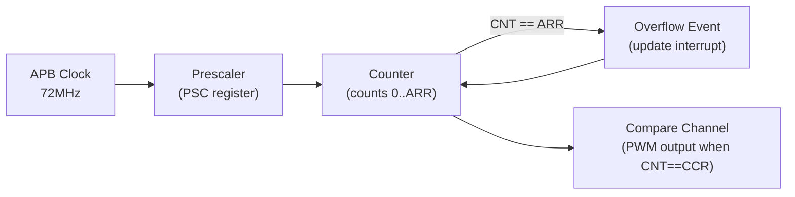

# :material-timer: Timers

!!! abstract "What You'll Learn"
    - Configure a timer for periodic interrupts (system tick)
    - Understand prescaler, auto-reload register, and counter
    - Use input capture to measure pulse width

---

## :material-lightbulb-on: Intuition

Timers are the heartbeat of embedded systems — periodic interrupts, PWM generation, input capture, and event counting all use timers.

---

## :material-vector-polyline: Diagram



---

## :material-code-tags: Code Examples

=== "Periodic Interrupt (1kHz)"
    ```c
    void timer_init_1khz(void) {
        RCC->APB1ENR |= RCC_APB1ENR_TIM2EN;

        // 72MHz / (72-1+1) / (1000-1+1) = 1kHz overflow
        TIM2->PSC = 72 - 1;     // prescaler: 72MHz → 1MHz
        TIM2->ARR = 1000 - 1;   // auto-reload: 1MHz / 1000 = 1kHz
        TIM2->DIER |= TIM_DIER_UIE;  // update interrupt enable
        TIM2->CR1  |= TIM_CR1_CEN;   // start counter

        NVIC_EnableIRQ(TIM2_IRQn);
        NVIC_SetPriority(TIM2_IRQn, 1);
    }

    void TIM2_IRQHandler(void) {
        if (TIM2->SR & TIM_SR_UIF) {
            TIM2->SR &= ~TIM_SR_UIF;  // clear flag
            // 1ms tick handler
        }
    }
    ```

---

## :material-alert: Pitfalls

!!! warning "Common Mistakes"
    - Prescaler and ARR are reload-on-update. Write PSC/ARR before enabling the timer or force an update event (`TIM->EGR = TIM_EGR_UG`)
    - Counter frequency = `(APB_CLK / (PSC+1))`. Period = counter frequency / `(ARR+1)`

---

## :material-help-circle: Flashcards

???+ question "Timer output frequency formula?"
    `f_out = f_apb / ((PSC+1) * (ARR+1))`

???+ question "What is input capture mode used for?"
    Measuring pulse width, frequency, or period of an external signal. The counter value is captured into CCR when an edge is detected on the input pin.

---

## :material-check-circle: Summary

Timer: prescaler divides APB clock, counter counts to ARR, overflow triggers interrupt/PWM. f_out = f_apb / ((PSC+1)*(ARR+1)).
