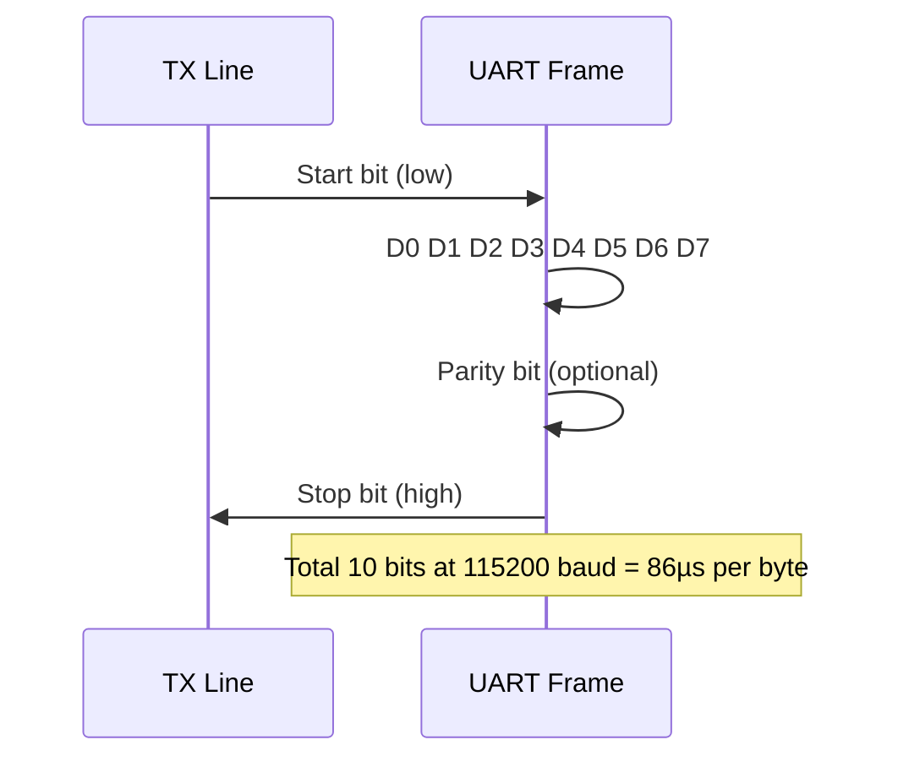

# :material-serial-port: UART — Async Serial Communication

!!! abstract "What You'll Learn"
    - Configure UART at a given baud rate
    - Send and receive bytes in polling and interrupt modes
    - Implement a ring buffer for interrupt-driven UART

---

## :material-lightbulb-on: Intuition

UART is the **printf of embedded systems** — your first debug channel. It runs without a shared clock; both ends agree on baud rate ahead of time.

!!! abstract "UART in one sentence"
    Fixed baud rate, 1 start bit + 8 data bits + 1 stop bit. No clock signal — both sides count bit periods.

---

## :material-vector-polyline: Diagram



---

## :material-code-tags: Code Examples

=== "STM32F1 Polling TX"
    ```c
    void uart_init(uint32_t baud) {
        RCC->APB2ENR |= RCC_APB2ENR_USART1EN | RCC_APB2ENR_IOPAEN;

        // PA9=TX (AF push-pull 50MHz), PA10=RX (input floating)
        GPIOA->CRH = (GPIOA->CRH & ~0xFF0u) | 0x4B0u;

        USART1->BRR = SystemCoreClock / baud;  // baud rate
        USART1->CR1 = USART_CR1_TE | USART_CR1_RE | USART_CR1_UE;
    }

    void uart_send_byte(uint8_t byte) {
        while (!(USART1->SR & USART_SR_TXE));  // wait TX empty
        USART1->DR = byte;
    }

    uint8_t uart_recv_byte(void) {
        while (!(USART1->SR & USART_SR_RXNE));  // wait RX not empty
        return USART1->DR;
    }
    ```

=== "Ring Buffer (Interrupt RX)"
    ```c
    #define RX_BUF_SIZE 64
    static uint8_t rx_buf[RX_BUF_SIZE];
    static volatile uint32_t rx_head, rx_tail;

    void USART1_IRQHandler(void) {
        if (USART1->SR & USART_SR_RXNE) {
            uint8_t data = USART1->DR;  // clears RXNE
            uint32_t next = (rx_head + 1) % RX_BUF_SIZE;
            if (next != rx_tail) { rx_buf[rx_head] = data; rx_head = next; }
        }
    }

    bool uart_rx_available(void) { return rx_head != rx_tail; }

    uint8_t uart_rx_read(void) {
        uint8_t d = rx_buf[rx_tail];
        rx_tail = (rx_tail + 1) % RX_BUF_SIZE;
        return d;
    }
    ```

---

## :material-alert: Pitfalls

!!! warning "Common Mistakes"
    - Always enable UART peripheral clock AND GPIO clock before configuration
    - Baud rate register value = `PCLK / baud`. Wrong PCLK value gives garbled output

---

## :material-help-circle: Flashcards

???+ question "What baud rate is most commonly used for debug UART?"
    115200 baud — it's fast enough for debug output and reliable at typical MCU clock speeds.

???+ question "Why use a ring buffer for UART RX?"
    Polling is too slow — you'll miss bytes at 115200 baud while the CPU is doing other work. The ISR stores bytes in the ring buffer; the application reads at its own pace.

???+ question "What happens if RXNE is not cleared before the next byte arrives?"
    Overrun error (ORE flag set). The incoming byte is lost. Clear ORE by reading SR then DR.

---

## :material-check-circle: Summary

UART: baud = PCLK / BRR. TX: wait TXE, write DR. RX: wait RXNE, read DR. Interrupt RX: ISR writes ring buffer, app reads from it.
